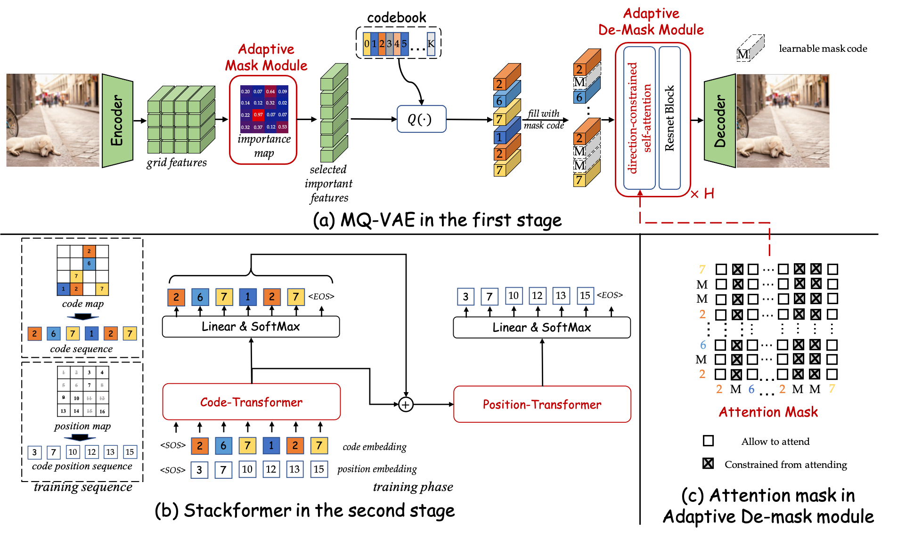
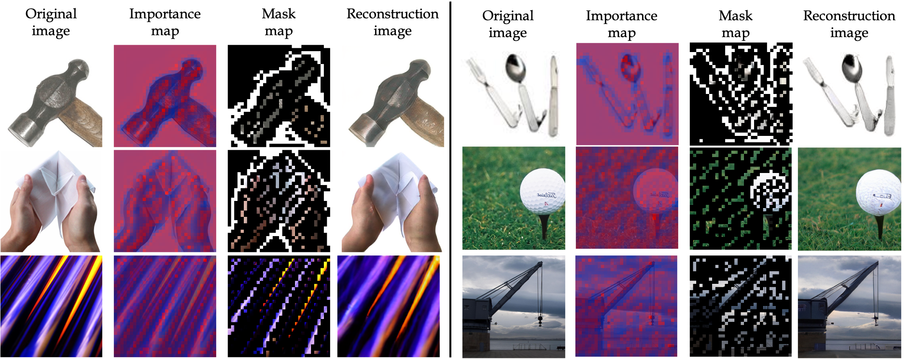

# MaskedVectorQuantization (CVPR2023)

Offical PyTorch implementation of our CVPR2023 paper "[Not All Image Regions Matter: Masked Vector Quantization for Autoregressive Image Generation](https://openaccess.thecvf.com/content/CVPR2023/papers/Huang_Not_All_Image_Regions_Matter_Masked_Vector_Quantization_for_Autoregressive_CVPR_2023_paper.pdf)".

**TL;DR** Existing vector-quantization (VQ) based autoregressive image generation simply models `all local region` information of images `without distinguishing their different perceptual importance` in the first stage, which brings redundancy in the learned codebook that not only limits the next stage’s autoregressive model’s ability to
model important structure but also results in high training cost and slow generation speed. In this study, we borrow the idea of importance perception from classical image coding theory and propose a novel two-stage framework, which consists of Masked Quantization VAE (MQVAE) and Stackformer, to relieve the model from modeling redundancy. 

Our framework includes: (1) MQ-VAE incorporates an adaptive mask module for masking redundant region features before quantization and an adaptive de-mask module for recovering the original grid image feature map to faithfully reconstruct the original images after quantization. (2) Then, Stackformer learns to predict the combination
of the next code and its position in the feature map.

**See Our Another CVPR2023 Highlight Work about Vector-Quantization based Image Generation**  "[Towards Accurate Image Coding: Improved Autoregressive Image Generation with Dynamic Vector Quantization](https://openaccess.thecvf.com/content/CVPR2023/papers/Huang_Towards_Accurate_Image_Coding_Improved_Autoregressive_Image_Generation_With_Dynamic_CVPR_2023_paper.pdf)" ([GitHub](https://github.com/CrossmodalGroup/DynamicVectorQuantization))



# Requirements and Installation
Please run the following command to install the necessary dependencies.

```
conda env create -f environment.yml
```

# Data Preparation
Prepare dataset as follows, then change the corresponding datapath in `data/default.py`.

## ImageNet
Prepare ImageNet dataset structure as follows:

```
${Your Data Root Path}/ImageNet/
├── train
│   ├── n01440764
│   |   |── n01440764_10026.JPEG
│   |   |── n01440764_10027.JPEG
│   |   |── ...
│   ├── n01443537
│   |   |── n01443537_2.JPEG
│   |   |── n01443537_16.JPEG
│   |   |── ...
│   ├── ...
├── val
│   ├── n01440764
│   |   |── ILSVRC2012_val_00000293.JPEG
│   |   |── ILSVRC2012_val_00002138.JPEG
│   |   |── ...
│   ├── n01443537
│   |   |── ILSVRC2012_val_00000236.JPEG
│   |   |── ILSVRC2012_val_00000262.JPEG
│   |   |── ...
│   ├── ...
├── imagenet_idx_to_synset.yml
├── synset_human.txt
```

## FFHQ
The FFHQ dataset could be obtained from the [FFHQ repository](https://github.com/NVlabs/ffhq-dataset). Then prepare the dataset structure as follows:
```
${Your Data Root Path}/FFHQ/
├── assets
│   ├── ffhqtrain.txt
│   ├── ffhqvalidation.txt
├── FFHQ
│   ├── 00000.png
│   ├── 00001.png
```

# Training of MQVAE

```
CUDA_VISIBLE_DEVICES=0,1,2,3,4,5,6,7 python train.py --gpus -1 --base configs/stage1/mqvae_imagenet_f8_r25.yml --max_epochs 50
```

The mask ratio could be set in `model.params.masker_config.params.topk_ratio` (i.e., mask ratio = 1 - `model.params.masker_config.params.topk_ratio`).

## Visualization of Adaptive Maske Module


# Training of Stackformer

## Unconditional Training:

Copy the first stage DQVAE's config to `model.params.first_stage_config`. Set the pre-trained DQVAE's ckpt path to `model.params.first_stage_config.params.ckpt_path`.

```
CUDA_VISIBLE_DEVICES=0,1,2,3,4,5,6,7 python train.py --gpus -1 --base configs/stage2/stackformer_imagenet_v12p12_uncond.yml --max_epochs 50
```

NOTE: Some important hyper-parameters:
- the layer of Code-Transformer: `model.params.transformer_config.params.value_layer`
- the layer of Position-Transformer: `model.params.transformer_config.params.position_layer`

## Class-conditional Training

```
CUDA_VISIBLE_DEVICES=0,1,2,3,4,5,6,7 python train.py --gpus -1 --base configs/stage2/stackformer_imagenet_v12p12_class.yml --max_epochs 50
```

# Reference
If you found this code useful, please cite the following paper:
```
@InProceedings{Huang_2023_CVPR,
    author    = {Huang, Mengqi and Mao, Zhendong and Wang, Quan and Zhang, Yongdong},
    title     = {Not All Image Regions Matter: Masked Vector Quantization for Autoregressive Image Generation},
    booktitle = {Proceedings of the IEEE/CVF Conference on Computer Vision and Pattern Recognition (CVPR)},
    month     = {June},
    year      = {2023},
    pages     = {2002-2011}
}
```

```
@InProceedings{Huang_2023_CVPR,
    author    = {Huang, Mengqi and Mao, Zhendong and Chen, Zhuowei and Zhang, Yongdong},
    title     = {Towards Accurate Image Coding: Improved Autoregressive Image Generation With Dynamic Vector Quantization},
    booktitle = {Proceedings of the IEEE/CVF Conference on Computer Vision and Pattern Recognition (CVPR)},
    month     = {June},
    year      = {2023},
    pages     = {22596-22605}
}
```